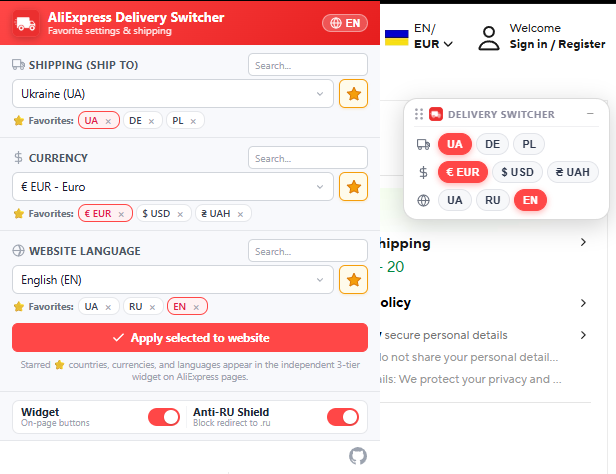

# AliExpress Delivery Switcher

[](https://developer.chrome.com/docs/extensions/mv3/intro/)
[](https://www.chromium.org)
[](https://github.com/MANCrimSon/AliExpress-Delivery-Switcher/releases/latest)
[](https://github.com/MANCrimSon/AliExpress-Delivery-Switcher/releases/latest)
[](LICENSE)

> **AliExpress Delivery Switcher** is an advanced Manifest V3 browser extension for **Google Chrome and all Chromium-based browsers** (Brave, Microsoft Edge, Opera, Vivaldi, Arc, etc.). It delivers instant 1-click switching of delivery country, currency, and language directly on AliExpress pages, guarantees protection against forced `.ru` redirects, blocks annoying cookie consent banners, and saves your favorite shopping presets.

<p align="center">
  
</p>

---

## 🚀 Key Features

- **🚛 3-Tier Floating On-Page Widget**  
  An isolated floating widget right on AliExpress product and catalog pages. Switch shipping country, currency, and language in a single click with instant page reload. Supports **Drag & Drop** positioning and **Minimize** mode to keep your screen clean.

- **⭐ Independent Starred Favorites**  
  Pin your most-used delivery destinations (e.g. 🇺🇦 Ukraine, 🇵🇱 Poland, 🇩🇪 Germany), currencies (UAH, EUR, USD), and languages to the top of dropdown lists and immediately reflect them on your floating widget.

- **🛡️ Anti-RU Redirect & Circuit Breaker**  
  Automatically intercepts and redirects forced `aliexpress.ru` and `gatewayAdapt=glo2rus` landings back to the global `www.aliexpress.com`. Built-in loop-prevention circuit breaker prevents infinite redirect loops.

- **🍪 EU / GDPR Cookie Banner Auto-Accept**  
  Silently suppresses and automatically accepts intrusive OneTrust, AliExpress GDPR, and CMP cookie consent dialogs that clutter the viewport and block interactions.

- **⚡ Instant Cookie Injection**  
  Directly applies the session cookie (`aep_usuc_f`) via Chrome Cookie API alongside AliExpress `setCommonCookie` sync, ensuring changes take effect immediately without delays.

- **🔍 Instant Search & Alphabetical Sorting**  
  Easily find any country, currency, or language in the world with instant real-time search filtering in the popup.

- **🌐 Trilingual Interface**  
  Full native localization of the popup UI into **Українська (UA)**, **English (EN)**, and **Русский (RU)** with 1-click language toggling.

- **🧩 Universal Chromium Compatibility**  
  Fully compatible with all Chromium engines: Google Chrome, Brave Browser, Microsoft Edge, Opera & Opera GX, Vivaldi, Arc, and others.

---

## 📥 Installation

<details>
<summary><b>🇺🇦 Інструкція зі встановлення (натисніть, щоб розгорнути)</b></summary>

### 🔹 Варіант A: З магазину Chrome Web Store (Рекомендовано після публікації)
> *Розширення проходить модерацію. Пряме посилання на встановлення з магазину з'явиться тут найближчим часом.*  
> *Працює у всіх браузерах на базі Chromium (Chrome, Brave, Edge, Opera, Vivaldi тощо).*

---

### 🔹 Варіант B: Ручне встановлення через режим розробника (Миттєво та безкоштовно)

1. **Завантажте розширення**:
   - Перейдіть у розділ **[Останній реліз (Latest Release)](https://github.com/MANCrimSon/AliExpress-Delivery-Switcher/releases/latest)** та завантажте готовий архів `aliexpress-delivery-switcher-v*.zip` (у блоці Assets).
   - Розархівуйте ZIP у будь-яку зручну папку на комп'ютері (наприклад, у `Документи`).
2. **Відкрийте сторінку керування розширеннями у вашому браузері**:
   - Введіть в адресному рядку `chrome://extensions` та натисніть <kbd>Enter</kbd> (універсально для всіх Chromium-браузерів: Chrome, Edge, Brave, Opera тощо автоматично відкриють потрібну сторінку).
3. **Увімкніть режим розробника**:
   - Увімкніть перемикач **Режим розробника** (Developer mode) у правому або лівому кутку сторінки.
4. **Завантажте розширення**:
   - Натисніть кнопку **Завантажити розпаковане** (Load unpacked).
   - Виберіть папку з розпакованими файлами (де розташований файл `manifest.json`).
5. **Закріпіть значок на панелі**:
   - Натисніть на значок «пазла» 🧩 праворуч від адресного рядка та закріпіть розширення (значок шпильки 📌).

---

### 🔄 Як оновити розширення:
1. Завантажте новий архів розширення з розділу **[Останній реліз (Latest Release)](https://github.com/MANCrimSon/AliExpress-Delivery-Switcher/releases/latest)**.
2. Розархівуйте його **із заміною файлів** у ту саму папку, де встановлено розширення.
3. Відкрийте сторінку розширень у браузері (`chrome://extensions`) і натисніть кнопку **Перезавантажити** / **Reload** на картці розширення (або кнопку **🔄 Оновити** у верхній панелі).
</details>

<br>

<details>
<summary><b>🇬🇧 English Installation Guide (click to expand)</b></summary>

### 🔹 Option A: From Chrome Web Store (Recommended once published)
> *Extension submission in progress. Direct Web Store install link will be available here soon.*  
> *Works natively in Google Chrome, Brave, Edge, Opera, and Vivaldi.*

---

### 🔹 Option B: Manual Installation via Developer Mode (Free & Instant for all Chromium browsers)

1. **Download the project**:
   - Go to the **[Latest Release](https://github.com/MANCrimSon/AliExpress-Delivery-Switcher/releases/latest)** and download the ready-to-use `aliexpress-delivery-switcher-v*.zip` (under Assets).
   - Extract the ZIP archive anywhere on your PC (e.g. into `Documents` or `Desktop`).
   - *(Alternative for developers)*:
     ```bash
     git clone https://github.com/MANCrimSon/AliExpress-Delivery-Switcher.git
     ```
2. **Open Extensions page in your Chromium browser**:
   - Type `chrome://extensions` in the address bar and press <kbd>Enter</kbd> (universal for all Chromium browsers: Chrome, Edge, Brave, Opera, etc. will automatically route to their internal extensions page).
3. **Enable Developer Mode**:
   - Turn on the **Developer mode** toggle switch (usually in the top-right or top-left corner).
4. **Load the extension**:
   - Click the **Load unpacked** button.
   - In the file dialog, select the unzipped folder containing `manifest.json`.
5. **Pin to Toolbar**:
   - Click the extensions puzzle icon (🧩) on your browser toolbar and pin **AliExpress Delivery Switcher** for instant 1-click access!

---

### 🔄 How to Update the Extension:
1. Download the newest ZIP package from the **[Latest Release](https://github.com/MANCrimSon/AliExpress-Delivery-Switcher/releases/latest)**.
2. Extract it **overwriting existing files** in your extension folder.
3. Go to `chrome://extensions` and click **Reload** (🔄) on the extension card (or the top toolbar **Update** button).
</details>

<br>

<details>
<summary><b>🇷🇺 Инструкция по установке (нажмите, чтобы развернуть)</b></summary>

### 🔹 Вариант A: Из магазина Chrome Web Store (Рекомендуется после публикации)
> *Расширение находится на публикации. Прямая ссылка на установку из стора появится здесь в ближайшее время.*  
> *Работает во всех браузерах на базе Chromium (Chrome, Brave, Edge, Opera, Vivaldi и др.).*

---

### 🔹 Вариант B: Ручная установка через режим разработчика (Мгновенно и бесплатно)

1. **Скачайте расширение**:
   - Перейдите в раздел **[Последний релиз (Latest Release)](https://github.com/MANCrimSon/AliExpress-Delivery-Switcher/releases/latest)** и скачайте готовый архив `aliexpress-delivery-switcher-v*.zip` (в блоке Assets).
   - Распакуйте скачанный ZIP-архив в любую удобную папку на компьютере (например, в `Документы`).
2. **Откройте страницу управления расширениями в вашем браузере**:
   - Вставьте в адресную строку `chrome://extensions` и нажмите <kbd>Enter</kbd> (универсально для всех Chromium-браузеров: Chrome, Edge, Brave, Opera и др. автоматически откроют нужный раздел).
3. **Включите режим разработчика**:
   - Включите переключатель **Режим разработчика** (Developer mode) в верхнем углу страницы.
4. **Загрузите расширение**:
   - Нажмите кнопку **Загрузить распакованное** (Load unpacked).
   - Выберите папку, в которую распаковали файлы (где находится файл `manifest.json`).
5. **Закрепите иконку на панели**:
   - Нажмите на значок «пазла» 🧩 на панели браузера и закрепите расширение (кнопка булавки 📌).

---

### 🔄 Как обновить расширение:
1. Скачайте свежий архив расширения из раздела **[Последний релиз (Latest Release)](https://github.com/MANCrimSon/AliExpress-Delivery-Switcher/releases/latest)**.
2. Распакуйте архив **с заменой файлов** в ту же папку, куда было установлено расширение.
3. Откройте в браузере `chrome://extensions` и нажмите кнопку **Перезагрузить** на карточке расширения (либо кнопку **🔄 Обновить** в верхней панели браузера).
</details>

---

## 🎯 How to Use

<details>
<summary><b>🇺🇦 Як користуватися (натисніть, щоб розгорнути)</b></summary>

1. **Відкрийте AliExpress**: перейдіть на будь-яку сторінку [aliexpress.com](https://www.aliexpress.com).
2. **Плаваючий віджет на сторінці**:
   - Зверніть увагу на червону панель у правому нижньому кутку.
   - Натисніть на код країни (наприклад, **UA**, **PL**, **DE**), щоб миттєво змінити країну доставки та оновити сторінку.
   - Натискайте валюту (**UAH**, **EUR**, **USD**) або мову (**UA**, **EN**, **RU**), щоб перемикати їх окремо.
   - **Перетягування (Drag & Drop)**: затисніть шапку віджета або крапки зліва, щоб перемістити його у будь-яке зручне місце на екрані.
   - **Згортання (Minimize)**: натисніть `−` у шапці віджета, щоб згорнути його в компактну статус-пігулку. Натисніть на пігулку будь-коли, щоб розгорнути назад.
3. **Спливаюче вікно (Попап)**:
   - Натисніть на значок вантажівки на панелі браузера.
   - Позначайте зірочкою (**⭐**) будь-які країни, валюти або мови — вони миттєво додадуться кнопками у ваш плаваючий віджет на AliExpress!
   - Використовуйте поле швидкого пошуку, щоб миттєво знайти потрібну країну чи валюту серед усіх у світі.
   - Перемикайте мову попапа кнопкою **UA / EN / RU** у правому верхньому кутку.
</details>

<br>

<details>
<summary><b>🇬🇧 How to Use Guide (click to expand)</b></summary>

1. **Open AliExpress**: Go to any page on [aliexpress.com](https://www.aliexpress.com).
2. **On-Page Floating Widget**:
   - Notice the floating red widget at the bottom right of the page.
   - Click any country code (e.g. **UA**, **PL**, **DE**) to instantly switch delivery destination and reload.
   - Click currency (**UAH**, **EUR**, **USD**) or language (**UA**, **EN**, **RU**) to switch them independently.
   - **Drag & Drop**: Click and hold the header or drag-dots to move the widget anywhere on your screen.
   - **Minimize**: Click `−` in the widget header to collapse it into a sleek status pill. Click the pill anytime to restore it.
3. **Popup Interface**:
   - Click the extension truck icon in the browser toolbar.
   - Mark any country, currency, or language with the star (**⭐**) to instantly add it to your on-page floating widget!
   - Use the live search inputs to quickly find any country or currency worldwide.
   - Switch popup interface language via the **UA / EN / RU** button in the top right.
</details>

<br>

<details>
<summary><b>🇷🇺 Как пользоваться (нажмите, чтобы развернуть)</b></summary>

1. **Откройте AliExpress**: перейдите на любую страницу [aliexpress.com](https://www.aliexpress.com).
2. **Плавающий виджет на странице**:
   - Обратите внимание на красную панель в правом нижнем углу.
   - Нажмите на код страны (например, **UA**, **PL**, **DE**), чтобы мгновенно сменить страну доставки и перезагрузить страницу.
   - Нажимайте на валюту (**UAH**, **EUR**, **USD**) или язык (**UA**, **EN**, **RU**), чтобы переключать их независимо.
   - **Перетаскивание (Drag & Drop)**: зажмите шапку виджета или точки слева, чтобы переместить его в любое удобное место экрана.
   - **Сворачивание (Minimize)**: нажмите `−` в шапке виджета, чтобы свернуть его в компактную статус-пилюлю. Нажмите на пилюлю в любой момент, чтобы развернуть обратно.
3. **Всплывающее окно (Попап)**:
   - Нажмите на значок грузовичка на панели браузера.
   - Отмечайте звёздочкой (**⭐**) любые страны, валюты или языки — они мгновенно появятся кнопками в вашем плавающем виджете на страницах AliExpress!
   - Используйте строку быстрого поиска, чтобы найти любую страну или валюту мира.
   - Переключайте язык интерфейса попапа кнопкой **UA / EN / RU** в правом верхнем углу.
</details>

---

<details>
<summary><b>🛠️ How It Works & Architecture (Technical Details)</b></summary>

The extension is architected strictly under **Manifest V3** with full compliance to Google Chrome Web Store policies:

- **Service Worker (`js/background.js`)**:
  - Listens to `chrome.webNavigation.onBeforeNavigate` (strictly filtered to `aliexpress.ru`) to redirect before network requests begin.
  - Intercepts completed shortlink navigations (`onCommitted`) such as affiliate links (`ali.click`).
  - Manages session and consent cookies (`aep_usuc_f`, OneTrust, GDPR) across AliExpress domains.
  - Implements `#safeRedirectTab` circuit breaker limiting redirects to maximum 2 per 4 seconds per tab.

- **Isolated Floating Widget (`js/content.js`)**:
  - Encapsulated inside an isolated `ShadowRoot` (`attachShadow({ mode: 'open' })`) to prevent AliExpress stylesheet leakage from affecting widget controls.
  - Automatically syncs with `chrome.storage.sync` via `chrome.storage.onChanged` — any star added or removed in the popup is reflected on open tabs in real-time.
  - Saves your custom widget screen position persistently across browser sessions.

- **Fast & Responsive Popup (`popup.html`, `js/app.js`)**:
  - Compact ~430px height, 100% scroll-free layout designed for modern 1080p and high-DPI screens.
  - Live filtering inputs with 1-click clear buttons.
</details>

<br>

<details>
<summary><b>🔒 Permissions & Privacy Policy (Full Breakdown)</b></summary>

| Permission | Justification |
| :--- | :--- |
| `tabs` | Required to reload the active tab and apply updated shipping / currency parameters. |
| `storage` | Synchronizes user preferences and starred items across your browser profiles. |
| `cookies` | Direct read/write access for `aep_usuc_f` and consent cookies on AliExpress domains. |
| `webNavigation` | Intercepts forced `.ru` domain navigations before network resources load. |

> **Privacy Guarantee**: This extension is 100% private and open-source. It does **not** collect, store, or transmit any user data, browsing history, personal identity, or analytics to external servers. All operations occur strictly locally in your browser.
</details>

---

## 🤝 Contributing

Contributions, issues, and feature requests are welcome!  
Feel free to open an issue or submit a pull request on the [GitHub repository](https://github.com/MANCrimSon/AliExpress-Delivery-Switcher).

---

## 📄 License

This project is licensed under the [MIT License](LICENSE).  
Originally created by [svtcore](https://github.com/svtcore) (2022).  
Enhanced and maintained by [MANCrimSon](https://github.com/MANCrimSon) (2026).
